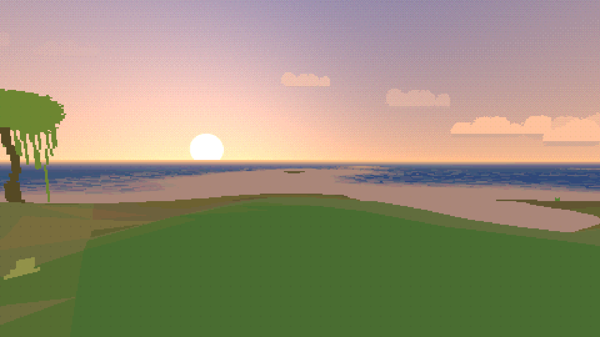
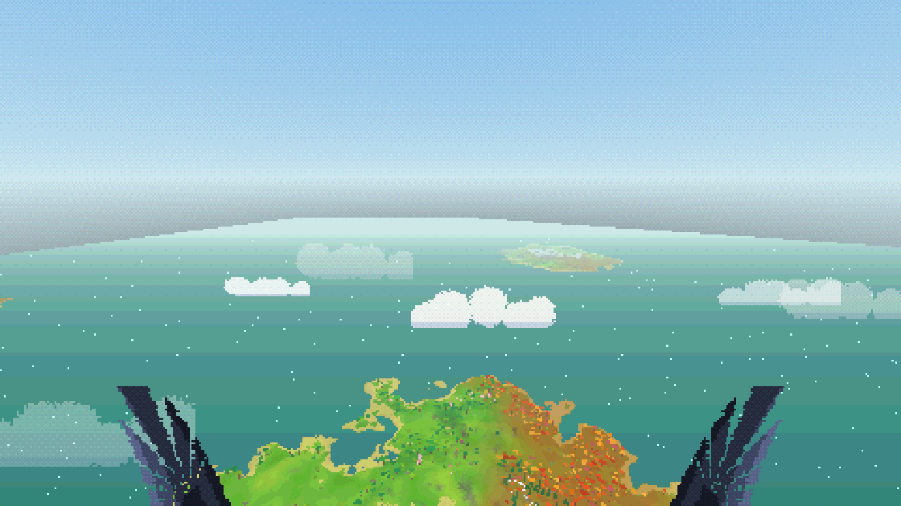
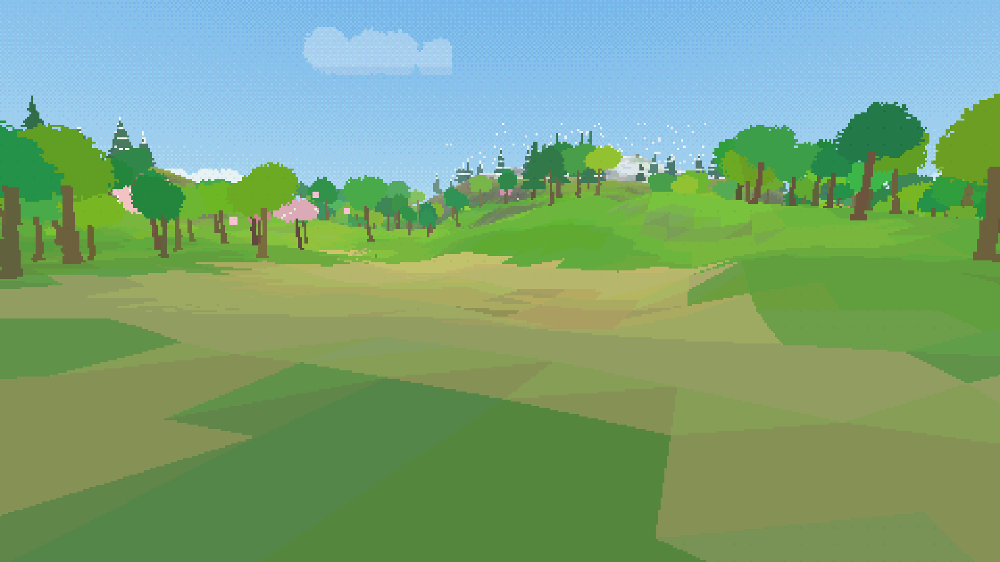
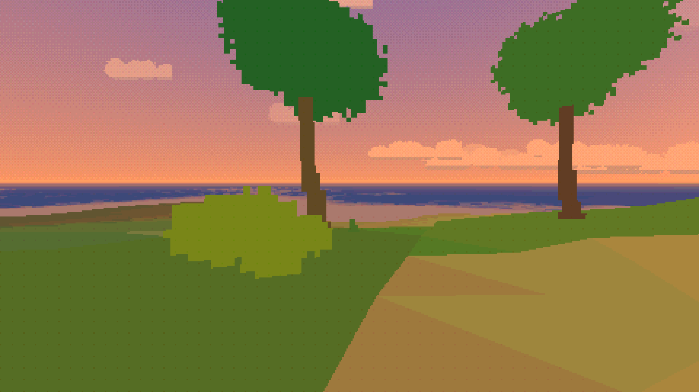
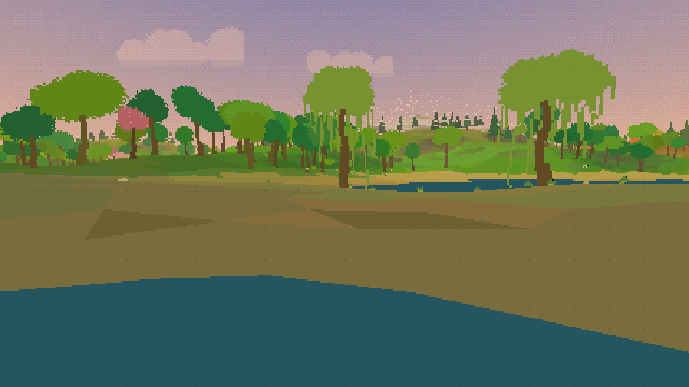
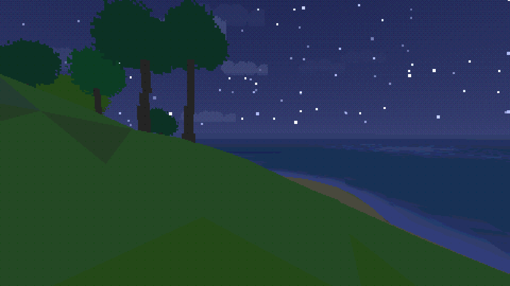

# isle

A quiet procedural island you walk in the browser. Day fades into night, the wind moves through the trees, and nothing asks you to hurry. Inspired by games like [Proteus](https://en.wikipedia.org/wiki/Proteus_(video_game)).

Press <kbd>Space</kbd> and you become a raven. The haze draws back as you climb, and the other islands are out there — a sea of them, each with its own weather of trees and stone. Land on one and it is yours to walk.

Every island is known by one large thing, and you can tell which from a long way off: a snowed peak, a needle of rock, a caldera with a still lake inside it, one enormous tree alone on a hill, or a weathered figure facing out to sea.

Terrain, creatures, and sound are all generated at runtime by a small custom engine. The whole game is **200 KB** of code and art, and the sea of islands is a pure function of one seed — nothing is stored, so it goes on as far as you care to fly.

[Play on itch.io](https://kengocodes.itch.io/isle) · [Play in browser](https://isle-gamma.vercel.app/) · [Source](https://github.com/kengocodes/isle)



<p align="center">
  
</p>
<p align="center">
  
  
</p>
<p align="center">
  
  
</p>

## Stack

- **TypeScript** + **Vite 6**
- Custom **WebGL2** renderer (no runtime dependencies)
- Custom loop: procedural world, pixel post, generative **Web Audio**

## Setup

```bash
npm install
npm run dev       # http://localhost:5173
npm run build     # type-check + bundle → dist/
npm run preview   # serve the production build
npm test
```

Static hosting: upload `dist/` (relative `base`, works in itch embeds). Vercel rewrites for legacy `/privacy` and `/terms` are in `vercel.json`.

## Controls

| Input         | On the island         | On the wing                     |
| ------------- | --------------------- | ------------------------------- |
| Click / tap   | Start (unlocks audio) |                                 |
| Mouse         | Look                  | Steer — you go where you point  |
| WASD / arrows | Walk                  | Tuck or spread, and bank        |
| Space         | Take to the air       | Beat your wings and climb       |
| Shift         | Stroll                | Fold your wings and stoop       |
| Esc           | Settings              | Settings                        |

Let go of <kbd>Space</kbd> to glide. Come down on land and you walk again; come down on water and you skim it and beat away. Diving trades height for speed, so a long crossing is a climb and then a long quiet fall.

Touch devices get **Walk** and **Fly** on the left, a stick for moving, and **Settings** up top; drag elsewhere to look.

Shareable islands use query params, e.g. `?seed=A7C3E911&t=0.26&weather=clear&goto=marsh`.

| Param | Effect |
| ----- | ------ |
| `seed` | Island seed (decimal or hex) |
| `t` | Day phase `0…1` |
| `weather` | Force `clear`, `cloudy`, or `rain` (stays that way) |
| `goto` | `marsh`, `peak`, `cairn`, `pool`, `autumn`, or `x,z` |
| `yaw` / `pitch` | Look angles |
| `shot=1` | Marketing mode (hides chrome; exposes `window.__isle`) |

## License

[MIT](LICENSE) © 2026 [kengocodes](https://github.com/kengocodes)
